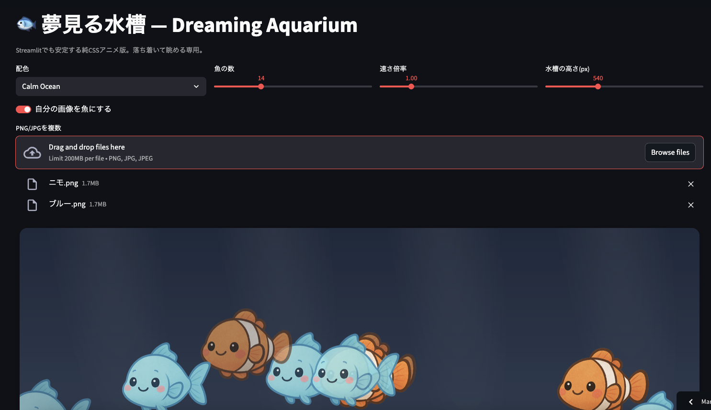

# 🐟 Dreaming Aquarium — "Yumemiru Suisou"

A minimal, hypnotic aquarium built with **Python + Streamlit**.  
Watch generative, AI-style fish gently swim across your screen — a digital space for calm and contemplation.

🎨 **Live Demo:** [👉 View on Streamlit Cloud]([https://your-username-dreaming-aquarium.streamlit.app](https://zitatori--aqualium-web-app-app-vtpcdd.streamlit.app/))



---

## 🌊 Features

- 🐠 **Procedurally generated fish** — Each fish is created on the fly using Pillow (no external API).  
- 🎨 **Palette themes** — Switch between calm color sets like *Calm Ocean*, *Warm Sunset*, etc.  
- 💨 **Adjustable animation** — Control swim speed, fish count, and bubble effects.  
- 🧘‍♀️ **Just watch** — No goals. No stress. Simply enjoy the movement.  
- ⚙️ (Optional) Upload your own fish images and see them swim.  

---

## 🚀 How to Run

```bash
# 1. Clone this repository
git clone https://github.com/YOUR_USERNAME/dreaming-aquarium.git
cd dreaming-aquarium

# 2. Install dependencies
pip install -r requirements.txt

# 3. Run the app
streamlit run app.py
